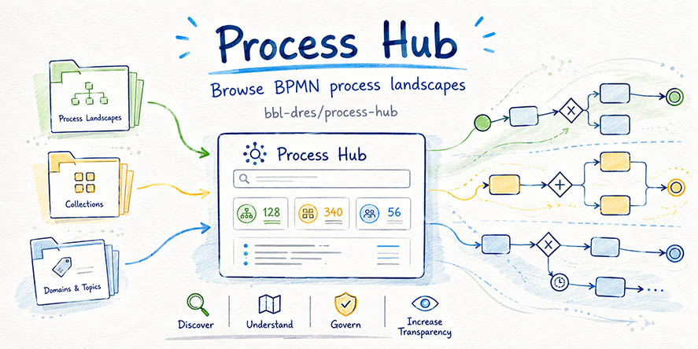
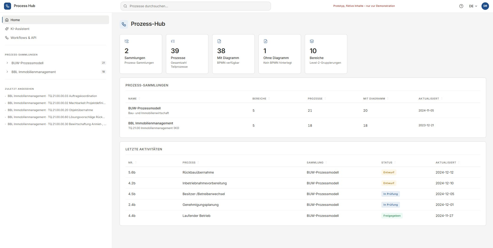
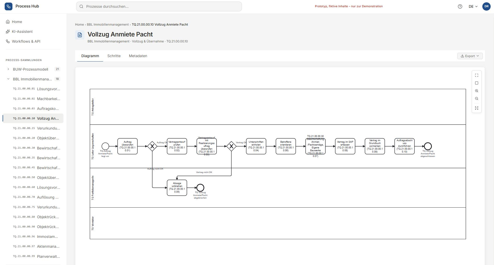

# Process Hub



[](https://opensource.org/licenses/MIT)


> [!CAUTION]
> **This is an unofficial mockup for demonstration purposes only.**
> All data is fictional. Not all features are fully functional. This project serves as a visual and conceptual prototype — it is not intended for production use.

A single-page, vanilla-JS reader for browsing BPMN process landscapes. Structured like a data catalog, read-only, and designed for non-modellers to navigate collections of documented business processes.

No build step. No framework. Load over an HTTP server and go.

<p align="center">
  
  &nbsp;
  
</p>

## Features

- **Multi-collection catalog with a recursive tree.** Each collection holds a nested `children[]` hierarchy: Collection → Level 1 → Level 2 (processes) → optional Level 3. Side-by-side today: [BUW-Prozessmodell](data/collections/buw.json) (Bau- und Immobilienwirtschaft, BUW Wuppertal) and [BBL Bauten](data/collections/bbl-immobilien.json) (Bundesamt für Bauten und Logistik, TQ.21.00 Immobilienmanagement K0).
- **Two views per container** (collection / Level 1 / Level 2-with-children): Diagramm (Signavio-style tile landscape) and Tabelle (sortable, groupable, filterable list).
- **Two tabs per process:** Diagramm (bpmn-js viewer with pan / wheel-zoom / fullscreen) and Schritte (flow nodes extracted live from the BPMN XML).
- **Right-side inspector panel.** Context-sensitive: shows element attributes when a BPMN shape is selected, process metadata otherwise. Resizable, with a comments section (stored in `localStorage`).
- **Shareable deep links.** Selecting a BPMN element writes `?el=<id>` into the URL; selection survives reload, share, and tab switches.
- **Exports** from any container or process: Excel (.xlsx), PDF, BPMN download (single file or ZIP), all reachable from a kebab menu in the title block.
- **Filter + grouping** on container views: filter by Owner / Status; group by parent / Owner / Status / none.
- **Home** with KPIs and a Letzte-Aktivitäten table sorted by `updatedAt`.
- **Workflows & API** page with per-collection export buttons and placeholders for REST API / Import.
- **Process metadata schema** informed by BPM CBOK, ArchiMate, ISO 9001 and Dublin Core — every process carries a fixed set of 20 fields, empty-by-default so gaps are visible in the JSON.

## Running locally

Open a terminal in the project root and start any static HTTP server — for example:

```bash
python -m http.server 8000
```

Then open <http://localhost:8000> in a browser.

> `file://` does **not** work: the app fetches `data/collections.json` + per-collection JSON + BPMN files, which browsers block under the `file:` scheme.

## Project structure

```
process-hub/
├── index.html                 # App shell (header, sidebar, main, inspector, footer)
├── css/
│   ├── tokens.css             # Design tokens (colors, spacing, typography)
│   └── styles.css             # All component + view styles
├── js/
│   ├── app.js                 # Entry, state, router, sidebar, inspector, global handlers
│   ├── views.js               # All view renderers (home/container/process/search/…)
│   ├── exports.js             # Excel / PDF / BPMN-ZIP downloads
│   └── bpmn.js                # bpmn-js viewer glue + BPMN XML parser
├── data/
│   ├── collections.json       # Collection index (id, code, name, description, …)
│   ├── collections/
│   │   ├── buw.json
│   │   └── bbl-immobilien.json
│   └── people.json            # Shared person roster (referenced by id)
├── assets/
│   ├── Social1.jpg            # Social preview banner
│   ├── bpmn/                  # BUW source BPMN files (Aeneis export)
│   ├── bpmn-bbl/              # BPMN files for BBL Immobilienmanagement
│   └── images/                # Preview screenshots
├── tools/
│   ├── extract-bbl.mjs        # One-off Node script: PDF → JSON + XLSX
│   ├── package.json           # xlsx dependency
│   └── bbl-extraction.xlsx    # Latest extractor output for review
├── DESIGN.md                  # Information architecture + metadata schema
└── README.md                  # This file
```

## Data model

Each collection has its own JSON with a recursive `children[]` tree. Container nodes (Level 1, optionally Level 2) carry only `id` + `name` + `children`; process nodes carry the full 20-field canonical attribute shape, with empty defaults where unset:

```jsonc
{
  "id": "bbl-immobilien",
  "children": [
    {
      "id": "TQ.21.00",
      "name": "Immobilienmanagement (K0)",
      "description": "Prozesssammlung rund um Akquisition, Vollzug, …",
      "children": [
        {
          "id": "TQ.21.00.00.02",
          "name": "Machbarkeit Projektdefinition",
          "bpmn": "assets/bpmn-bbl/TQ.21.00.00.02.bpmn",

          // Content (BPM CBOK)
          "description": "",
          "purpose": "",
          "trigger": "",
          "outputs": [],

          // Ownership (RACI-lite, people referenced by id from data/people.json)
          "owner": "",
          "responsible": [],
          "expert": "",

          // Lifecycle
          "status": "approved",       // draft | in-review | approved | deprecated
          "version": "1.0",
          "validFrom": "2023-12-21",
          "validUntil": "",
          "updatedAt": "2023-12-21",
          "reviewCycleMonths": null,

          // Classification
          "classification": "",
          "tags": [],

          // Context
          "systems": [],
          "standards": [],
          "linkedProcesses": { "predecessor": [], "successor": [], "related": [] },
          "documents": []
        }
      ]
    }
  ]
}
```

The collection index in `data/collections.json` carries display metadata (`code`, `name`, `description`, `owner`, `updatedAt`) plus the path to its tree file. Full rationale, trade-offs behind each field, and the standards they map to are in [DESIGN.md](DESIGN.md).

## Routes

Default views are URL-free (`?view=` only appears when the user picks the alternative tab). Selection state on a process is reflected via `?el=<bpmnElementId>` so deep links are sharable.

| URL | View |
|---|---|
| `#/` | Home (KPIs + collections + recent activity) |
| `#/chat` | KI-Assistent (placeholder) |
| `#/workflows` | Workflows & API (exports + REST API placeholder) |
| `#/c/{id}` | Collection landing → Diagramm (default) |
| `#/c/{id}?view=table` | Collection landing → Tabelle |
| `#/c/{id}/n/{l1}` | Level 1 → Diagramm |
| `#/c/{id}/n/{l1}?view=table` | Level 1 → Tabelle |
| `#/c/{id}/n/{l1}/{l2}` | Level 2 process → Diagramm |
| `#/c/{id}/n/{l1}/{l2}?view=steps` | Level 2 process → Schritte |
| `#/c/{id}/n/{l1}/{l2}?el=<id>` | Process diagram with a BPMN element preselected |
| `#/c/{id}/n/{l1}/{l2}/{l3}` | Level 3 (when present) |

Legacy `#/c/{id}/process/{pid}` URLs from an earlier route shape redirect transparently via a tree-search migration.

## Tooling

### BBL extractor

[tools/extract-bbl.mjs](tools/extract-bbl.mjs) reads Confluence-style PDF exports of the BBL Immobilienmanagement processes and produces:

- `tools/bbl-extraction.xlsx` — Processes / Steps / Groups sheets for human review.
- `data/collections/bbl-immobilien.json` — populated with id, name, purpose (Zweck), standards (Grundlagen), linked processes (Relevante Dokumente), validFrom (Freigabedatum), status.

The source PDFs are **not** tracked in this repo (too bulky and not open-source). To re-run, drop the `TQ.21.00 Immobilienmanagement (K0)` folder into `assets/`, then:

```bash
cd tools
npm install            # one-time: installs xlsx
node extract-bbl.mjs
```

### BPMN files for BBL

The 18 files in [assets/bpmn-bbl/](assets/bpmn-bbl/) were reconstructed from the source PDFs' embedded diagrams via a batch of Claude sub-agents — each one reading a high-DPI PNG render of a diagram page and producing BPMN 2.0 XML (semantic layer + BPMN DI for layout). Quality varies with source-diagram clarity; task names in the Schritte tab come authoritatively from the Prozessschritte tables.

## Dependencies

Runtime (via CDN, no install):

- [bpmn-js 17](https://github.com/bpmn-io/bpmn-js) — BPMN viewer with pan / wheel-zoom
- [SheetJS (xlsx) 0.18](https://sheetjs.com/) — Excel export
- [jsPDF 2.5 + autotable 3.8](https://github.com/parallax/jsPDF) — PDF export
- [JSZip 3.10](https://stuk.github.io/jszip/) — BPMN ZIP download
- [Lucide](https://lucide.dev/) — icons

Tooling: Node 18+ and `pdftotext` on PATH (ships with Git for Windows) for the BBL extractor.

## Acknowledgements

- **BUW-Prozessmodell** — Lehrstuhl für Digital Process and Building Management, [Bergische Universität Wuppertal](https://dpbb.uni-wuppertal.de/de/forschung/buw-prozessmodell-fuer-die-bau-und-immobilienwirtschaft/). Source of the 20 BPMN files under `assets/bpmn/`.
- **BBL Immobilienmanagement** — Bundesamt für Bauten und Logistik. Process documentation used as the basis for the Immobilienmanagement collection.
- **[data-catalog/prototype-sqlite](../data-catalog/prototype-sqlite)** — sibling project, source of the ported tokens + styles that give this UI its look and feel.

## License

Licensed under [MIT](https://opensource.org/licenses/MIT) — see [LICENSE](LICENSE).

---

> [!CAUTION]
> **This is an unofficial mockup for demonstration purposes only.**
> All data is fictional. Not all features are fully functional. This project serves as a visual and conceptual prototype — it is not intended for production use.
